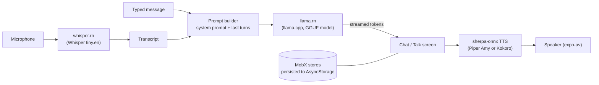

# Offline AI Chat


[](LICENSE)
[](https://riverborn.com)

**A React Native (Expo) chat app that runs a large language model,
speech-to-text and text-to-speech on the phone itself, with no server.**

You download a model once. After that, chatting, voice input (Whisper) and
spoken replies (Piper or Kokoro) all run on the device, and your messages
and audio are not sent anywhere. The app supports text chat with streaming
replies, a hands-free voice conversation mode, several open-weight models
to choose from, and saved chat history.

> [!NOTE]
> **Built by [Riverborn Limited](https://riverborn.com)**, an AI solutions
> company from Dhaka, Bangladesh. We build agentic AI, generative AI and
> conversational AI (voice, chat and RAG). If you need help building an
> on-device or voice AI product,
> **[book a call](https://riverborn.com/#book)** or email
> **[hello@riverborn.com](mailto:hello@riverborn.com)**.

> [!IMPORTANT]
> This app needs native modules (llama.cpp, whisper.cpp, sherpa-onnx), so it
> **does not run in Expo Go**. You need a development build
> (`npx expo run:android` or `npx expo run:ios`).

## Demo

https://github.com/user-attachments/assets/6e553bc7-5bee-4931-86f3-6d6e8105cc10

## Table of contents

- [Features](#features)
- [How it works](#how-it-works)
  - [Models](#models)
  - [Where data is stored](#where-data-is-stored)
- [Tech stack](#tech-stack)
- [Quick start](#quick-start)
- [Configuration](#configuration)
- [Project layout](#project-layout)
- [Troubleshooting](#troubleshooting)
- [Limitations and known issues](#limitations-and-known-issues)
- [About Riverborn](#about-riverborn)
- [License](#license) · [Acknowledgements](#acknowledgements)

---

## Features

| Area | What it does |
|---|---|
| **Chat** | Text chat with a local LLM. Replies stream in token by token. |
| **Talk** | Hands-free voice mode: you speak, Whisper transcribes, the LLM answers, and the answer is read aloud sentence by sentence. An optional auto-resume setting starts listening again after each reply. |
| **Voice input in chat** | Tap the microphone in the chat input to dictate a message with Whisper, transcribed on the device. |
| **Read aloud** | Tap the speaker icon on any reply to hear it with the selected text-to-speech voice. |
| **Model manager** | Download, load, switch and delete LLM and TTS models from the **Models** tab. Downloads run in the background and can resume. |
| **Kokoro voices** | Pick one of 11 English Kokoro voices (American and British, male and female) in **Settings**. |
| **Chat history** | Multiple chat sessions, saved on the device and kept between app restarts. |
| **Storage** | The **Storage** tab shows disk usage and lets you clear temporary downloads, chat history, models or all app data. |
| **Onboarding** | A first-run wizard helps you pick and download an LLM and a TTS model. |
| **Light and dark theme** | Follows the system setting. |

## How it works



1. **Models are downloaded once.** The first time you pick a model, the app
   downloads it from Hugging Face (and the eSpeak NG data from the
   sherpa-onnx GitHub releases) using a background downloader. This is the
   only time the app needs the internet. The Whisper model is downloaded
   automatically the first time the Chat or Talk screen loads speech-to-text.
2. **The LLM runs on the CPU** through `@pocketpalai/llama.rn`, a React
   Native binding for llama.cpp. The chat is sent as a list of
   system/user/assistant messages so llama.rn can apply each model's own chat
   template (TinyLlama gets a fixed template because some GGUF files lack
   one). Only the last few turns are sent, to keep the prompt small.
3. **Speech-to-text** uses `whisper.rn` (whisper.cpp) with the English
   `ggml-tiny.en` model in real-time mode, so you see the transcript as you
   speak.
4. **Text-to-speech** uses `react-native-sherpa-onnx`. The reply is split
   into short sentence chunks (up to 150 characters), each chunk is
   synthesized to a temporary WAV file and played with `expo-av`, so speech starts
   before the whole reply has been synthesized.
5. **State** lives in two MobX stores (`ModelStore` for models and
   inference, `ChatSessionStore` for chats). Both are saved to AsyncStorage
   with `mobx-persist-store`.

If the llama.cpp context is lost mid-conversation ("Context not found"),
`ModelStore` reloads the model from disk and retries once.

### Models

All model files come from public Hugging Face repositories. The links are in
[`utils/platformPaths.ts`](utils/platformPaths.ts).

**Language models (GGUF)**

| Model in the app | File | Size |
|---|---|---|
| TinyLlama 1.1B Chat v1.0 | `tinyllama-1.1b-chat-v1.0.Q4_K_M.gguf` | 638 MB |
| Phi-4 Mini (Light) | `phi-4-mini-iq2_m.gguf` | 1.40 GB |
| Gemma 2B IT | `gemma-2b-it.Q4_K_M.gguf` | 1.63 GB |
| Phi-3 Mini 4K Instruct | `phi-3-mini-4k-instruct-q4.gguf` | 2.23 GB |
| Phi-4 Mini Instruct | `Phi-4-mini-instruct-Q4_K_M.gguf` | 2.49 GB |
| Gemma 4 E2B (Small) | `google_gemma-4-E2B-it-IQ2_M.gguf` | 2.62 GB |
| Gemma 4 E4B IT | `google_gemma-4-E4B-it-Q4_K_M.gguf` | 5.41 GB |

**Speech models**

| Model | Used for | Size | Language |
|---|---|---|---|
| Whisper `ggml-tiny.en` | Speech-to-text | about 75 MB | English |
| Amy, low quality (Piper, VITS) | Text-to-speech | 63 MB | English (US) |
| Kokoro v0.19, 11 voices | Text-to-speech | 310 MB | English (US and UK voices) |

The eSpeak NG data that the Piper voice needs is bundled in the app as
[`assets/espeak-ng-data.zip`](assets) and unpacked on first launch.

### Where data is stored

- Models: the app's documents directory, under `models/`.
- Chats, settings and model state: AsyncStorage on the device.
- Text-to-speech audio: a single temporary WAV file (`temp_tts.wav`) in the documents directory, overwritten for each sentence.

Nothing is uploaded. Uninstalling the app removes all of it.

## Tech stack

| Layer | Technology |
|---|---|
| Framework | React Native 0.79 with Expo SDK 53 (old architecture, Hermes) |
| Language | TypeScript |
| Navigation | Expo Router (file-based tabs) |
| State | MobX, `mobx-react`, `mobx-persist-store` |
| LLM inference | `@pocketpalai/llama.rn` (llama.cpp) |
| Speech-to-text | `whisper.rn` (whisper.cpp), `react-native-audio-record` |
| Text-to-speech | `react-native-sherpa-onnx` (Piper VITS and Kokoro) |
| Audio playback | `expo-av` |
| Downloads | `@kesha-antonov/react-native-background-downloader` |
| Files | `expo-file-system`, `@dr.pogodin/react-native-fs` (patched with `patch-package`), `react-native-zip-archive` |
| Storage | `@react-native-async-storage/async-storage` |

## Quick start

### Prerequisites

- Node.js 18 or newer and Yarn 1.x (the repository ships a `yarn.lock`)
- **Android:** Android Studio with the Android SDK and NDK, and a device or
  emulator running Android 7.0 (API 24) or newer
- **iOS:** a Mac with Xcode and CocoaPods
- A phone with enough free storage and memory for the model you choose. The
  smallest LLM (TinyLlama) is 638 MB; a real device is recommended over an
  emulator.

### Install

```bash
git clone https://github.com/riverbornai/offline-ai-chat.git
cd offline-ai-chat
yarn install          # also runs patch-package (see patches/)
```

### Environment variables

None. The app has no API keys, accounts or backend, and there is no
`.env` file to fill in. Model download URLs are set in
[`utils/platformPaths.ts`](utils/platformPaths.ts) and
[`config/whisperConfig.ts`](config/whisperConfig.ts).

### Run

```bash
# Android (builds and installs a development build)
yarn android          # same as: npx expo run:android

# iOS (generates the ios/ folder on first run, then builds)
yarn ios              # same as: npx expo run:ios

# Start only the Metro bundler for an already installed development build
yarn start
```

On first launch, the onboarding wizard asks you to choose and download an
LLM and a TTS model. The phone needs an internet connection for this step.
After the downloads finish, you can turn on airplane mode and keep using the
app.

### Release builds

```bash
npx expo run:android --variant release
npx expo run:ios --configuration Release
```

The Android `release` build type is signed with the standard debug keystore
(`android/app/debug.keystore`, referenced in
[`android/app/build.gradle`](android/app/build.gradle)). Set up your own
signing key before you distribute an APK or AAB. You can also build with
[EAS Build](https://docs.expo.dev/build/introduction/) using the profiles in
[`eas.json`](eas.json); run `eas init` first to link the project to your own
Expo account.

## Configuration

Most settings are constants in the source code.

| What | Where | Default |
|---|---|---|
| Available models and download URLs | [`stores/ModelStore.ts`](stores/ModelStore.ts), [`utils/modelSetup.ts`](utils/modelSetup.ts), [`utils/platformPaths.ts`](utils/platformPaths.ts) | 7 LLMs, 2 TTS models |
| Context size, threads, batch size, GPU layers | `ModelStore` constructor | Android: 1024 tokens, 4 threads, batch 512, 0 GPU layers. iOS: 1536 tokens. Large models (full Gemma 4 and Phi-4) are capped at 512 tokens and batch 128; other models except TinyLlama at 768 tokens. |
| Sampling | `defaultCompletionParams` in `ModelStore` | temperature 0.7, top_p 0.9, top_k 40 |
| Reply length | [`components/ChatScreen.tsx`](components/ChatScreen.tsx), [`screens/TalkScreen.tsx`](screens/TalkScreen.tsx) | 256 tokens (Chat), 180 tokens (Talk) |
| System prompt and history window | [`stores/ChatSessionStore.ts`](stores/ChatSessionStore.ts), [`utils/chat.ts`](utils/chat.ts) | Short "helpful assistant" prompt; last 3 messages, up to 800 characters |
| Whisper model and language | [`config/whisperConfig.ts`](config/whisperConfig.ts) | `ggml-tiny.en`, English |
| Kokoro voice | **Settings** tab in the app | Default (American female) |

To add an LLM, add an entry with the same `id` to the model list in
`ModelStore.ts`, to `AVAILABLE_MODELS` in `utils/modelSetup.ts`, and a
download URL to `MODEL_DOWNLOAD_URLS` in `utils/platformPaths.ts`.

`yarn cache:info` and the other `cache:*` scripts
([`scripts/cache-cli.js`](scripts/cache-cli.js)) only look at model files in
the project folders on your computer. To manage storage on the phone, use the
**Storage** tab in the app.

## Project layout

```
app/              Expo Router screens: root layout and the five tabs (Chat, Talk, Models, Storage, Settings)
components/       UI: chat screen, message bubbles, input with voice dictation, onboarding, storage manager
screens/          TalkScreen, the hands-free voice conversation screen
stores/           MobX stores: ModelStore (models, downloads, llama.cpp context) and ChatSessionStore (chats)
services/         whisperService (speech-to-text) and ttsService (text-to-speech)
utils/            model download and setup, file paths, prompt building, cache helpers, storage adapter
config/           Whisper model settings
constants/        theme colours and the Kokoro voice list
hooks/            colour-scheme hooks
assets/           fonts, app icons, splash image and the bundled eSpeak NG data
android/          native Android project
patches/          patch-package fix for @dr.pogodin/react-native-fs
scripts/          cache-cli.js helper for the cache:* scripts
```

## Troubleshooting

- **"Native module not found" or the app crashes in Expo Go.** Use a
  development build: `npx expo run:android` or `npx expo run:ios`.
- **A model will not load, or you see "Context not found".** Open the
  **Models** tab, delete the model, download it again and tap **Load
  Model**. If the phone is low on memory, try a smaller model such as
  TinyLlama or Phi-4 Mini (Light).
- **The app runs out of memory on Android.** Use a smaller model and close
  other apps. `largeHeap` is already enabled in [`app.json`](app.json).
- **No speech output.** Check that a TTS model is downloaded in the
  **Models** tab, restart the app after downloading a new voice, and check
  the phone's volume and silent mode.
- **The microphone does nothing.** Allow microphone access when asked. The
  Whisper model is downloaded the first time speech-to-text starts, so the
  phone needs a connection that one time.
- **Android build fails with a Gradle error.** Run `cd android && ./gradlew clean && cd ..`,
  then `npx expo run:android` again.

## Limitations and known issues

- **CPU only.** `n_gpu_layers` is 0, so replies are slow on large models,
  and the context window is small (512 to 1536 tokens) to avoid running out
  of memory. Only the last few messages are sent to the model, so it does
  not remember long conversations.
- **English speech only.** Whisper uses the English-only `tiny.en` model,
  and both TTS models are English. The LLMs may reply in other languages,
  but voice input and output are English.
- **Text only.** Gemma 4 is a multimodal model, but this app only sends
  text to it.
- **Small models make mistakes.** On-device models of 1 to 4 billion
  parameters can give wrong or made-up answers. Check anything important.
- **Large downloads.** Models are 0.6 to 5.4 GB. The first setup needs a
  good connection and enough free storage.
- **The Android release build is signed with the debug key.** Replace it
  before distributing the app.
- **The `ios/` folder is not checked in.** It is generated by
  `npx expo run:ios`. The iOS build was not re-verified for this release.
- **No web support.** Model downloads and inference only work on Android
  and iOS.
- **No system prompt editor.** The system prompt is set in code
  ([`stores/ChatSessionStore.ts`](stores/ChatSessionStore.ts)).
- **No automated tests** are included.

## About Riverborn

This app was designed and built by **[Riverborn Limited](https://riverborn.com)**,
an AI solutions company based in Dhaka, Bangladesh that builds AI systems for
clients worldwide. We built it to show that a useful chat and voice assistant
can run entirely on a phone, with no server and no data leaving the device.
Read the case study at
[riverborn.com/case-studies/offline-ai-chat](https://riverborn.com/case-studies/offline-ai-chat).

What we build:

- 🤖 **Agentic AI:** autonomous AI agents and multi-agent systems that
  automate real business workflows
- ✨ **Generative AI:** AI products and MVPs built on large language
  models, taken from prototype to production
- 💬 **Conversational AI:** voice AI agents, chatbots, and RAG systems that
  answer from your own documents and data

Need help with AI? We'd like to hear from you.

- 🌐 Website: [riverborn.com](https://riverborn.com)
- 📅 Book a discovery call: [riverborn.com/#book](https://riverborn.com/#book)
- ✉️ Email: [hello@riverborn.com](mailto:hello@riverborn.com)
- 💼 [LinkedIn](https://www.linkedin.com/company/74964253) · [X](https://x.com/riverbornai) · [Facebook](https://facebook.com/riverbornai) · [GitHub](https://github.com/riverbornai)

## License

This project is licensed under the
**[PolyForm Internal Use License 1.0.0](LICENSE)**.

- You may use, run and modify it for free for your own or your company's
  internal purposes.
- You may not sell it, redistribute it, or offer it to others as a product
  or hosted service.
- For a commercial license, email
  **[hello@riverborn.com](mailto:hello@riverborn.com)**.

See [LICENSE](LICENSE) for the full terms. The models the app downloads, the
bundled eSpeak NG data and the fonts are not covered by this license; each
keeps its own license from its authors. Contributions are accepted under the
same license as the repository (see [CONTRIBUTING.md](CONTRIBUTING.md)).

## Acknowledgements

- [llama.cpp](https://github.com/ggml-org/llama.cpp) and
  [llama.rn](https://github.com/mybigday/llama.rn) (used here through the
  `@pocketpalai/llama.rn` package) for on-device LLM inference
- [whisper.cpp](https://github.com/ggml-org/whisper.cpp) and
  [whisper.rn](https://github.com/mybigday/whisper.rn) for speech-to-text
- [sherpa-onnx](https://github.com/k2-fsa/sherpa-onnx) for the text-to-speech runtime and model packaging
- [Piper](https://github.com/rhasspy/piper) and
  [Kokoro](https://huggingface.co/hexgrad/Kokoro-82M) for the voices, and
  [eSpeak NG](https://github.com/espeak-ng/espeak-ng) for phoneme data
- The model authors (TinyLlama, Microsoft Phi, Google Gemma) and the
  Hugging Face uploaders of the GGUF files
- [Expo](https://expo.dev) and the React Native community
